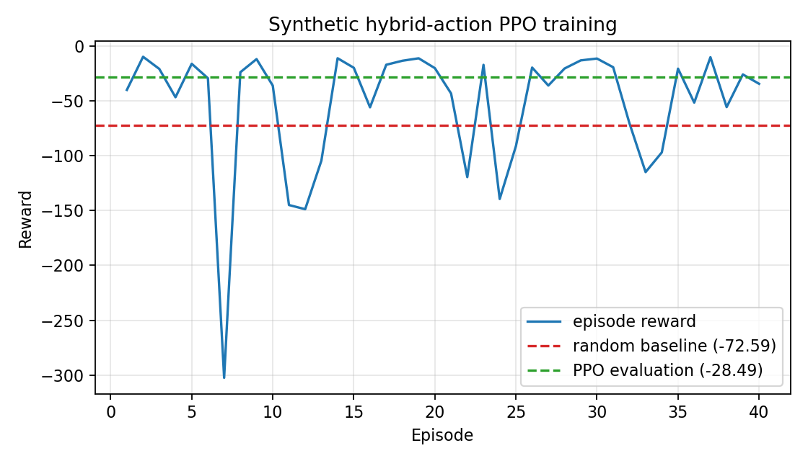

# PPO Learning Demo for Hybrid Discrete–Continuous Control

本專案使用一個簡化的混合動作控制環境，展示 PPO（Proximal Policy Optimization）的完整訓練流程。Agent 的目標是在有限步數內，將目前的資源數值調整至目標值；每一步同時選擇離散移動方向與連續移動幅度，環境以動作成本鼓勵策略在接近目標與穩定控制之間取捨。

這是一個著重於理解強化學習流程的教學型作品，程式以可閱讀、可執行與可討論為設計目標：

```text
synthetic state
      ↓
Toy environment  ← hybrid action ← PPO actor
      ↓ reward / transition
rollout buffer → advantage estimation → policy/value update
      ↓
CSV logging → training curve → evaluation with a separate seed
```

## Demonstrated Skills

- Python、NumPy、PyTorch
- RL environment abstraction and state transition
- PPO actor／critic、rollout、GAE、clipped objective
- Categorical discrete-action head + sigmoid-squashed Gaussian continuous-action head
- deterministic seed、configuration、smoke tests
- CSV logging、plotting、deterministic evaluation、random-policy baseline

## Project Structure

```text
simplified_demo/
├── config.py        # 訓練超參數與環境設定
├── env.py           # toy environment 的 state、hybrid action、transition、reward
├── ppo.py           # two-head Actor-Critic、rollout、GAE 與 PPO update
├── train.py         # 訓練、記錄、繪圖與 evaluation
└── requirements.txt # 執行所需套件
```

## Learning Guide

### Environment

`ToyResourceEnv` 是一個合成的教學環境，不對應特定真實系統。它的目的是讓 Agent 在簡單、可控制的情境中練習 PPO 的完整流程：觀察 state、輸出混合 action、取得 reward、收集 rollout，再更新 Actor 與 Critic。

state 為 `state = [position, target, remaining]`，維度為 `(3,)`：

- `position`：目前資源位置。
- `target`：目標位置；預設固定為 `0.8`。雖然固定 target 對目前 demo 而言是常數，仍保留在 state 中，以呈現 goal-conditioned control 的輸入設計，並讓環境未來可改為每回合使用不同目標。
- `remaining`：剩餘步數比例，計算方式為 `1 - step_count / horizon`。它讓 Agent 知道有限步數任務中還剩多少時間可以完成控制。

Agent 的混合 action 由兩個部分組成：

- `direction`：離散值 `-1` 或 `+1`，分別代表往負／正方向移動。
- `magnitude`：介於 `(0, 1)` 的連續值，代表移動幅度。

環境實際使用兩者的乘積；`step_size` 是此控制量對位置造成影響的最大倍率，而不是每一步唯一可選的移動量：

```text
effective action = direction × magnitude
position change = step_size × effective action
```

在預設的 `step_size = 0.15` 下，`direction = +1, magnitude = 1.0` 會使位置增加 `0.15`；`direction = +1, magnitude = 0.5` 約增加 `0.075`；`direction = -1, magnitude = 0.4` 約減少 `0.06`。距離目標越近，reward 越高，過大的 magnitude 則會產生成本。每個 episode 仍會從不同的初始位置開始，讓 Agent 不會只適應單一初始狀態。

### Actor, Critic, and Rollout

Actor 根據 state 建立兩個 action distribution；Critic 估計目前 state 的未來回報。每個 episode 會收集 state、direction、magnitude、reward、done、joint log probability 與 value estimate，形成一批 rollout 資料供後續更新。

共享神經網路後接兩個 Actor head：

- **Direction head** 輸出兩個 logits，形成 Categorical distribution，抽樣或選出 `-1`／`+1`。
- **Magnitude head** 輸出 Gaussian distribution 的 mean 與 standard deviation，抽樣得到 latent value `z`，再以 `magnitude = sigmoid(z)` 轉換為 `(0, 1)`。

`direction` 的 Categorical distribution 描述正／負方向的選擇機率；`magnitude` 雖然也落在 `(0, 1)`，但它代表最大移動幅度的使用比例，而不是方向的機率。

joint policy 為 `π(direction, magnitude | state) = π_d(direction | state) × π_m(magnitude | state)`。PPO 使用兩者 log probability 的總和計算新舊策略比值；連續 head 的 log probability 納入 sigmoid 的 Jacobian 修正，確保新舊 policy 評分的是同一個執行過的 magnitude。

### GAE and PPO Clipping

GAE（Generalized Advantage Estimation）用 reward 與 value estimate 計算 advantage，描述某次 action 的結果相對於 Critic 預期的好壞。PPO 則使用 clipped objective 限制新舊策略的差異，避免策略在單次更新時改變過大。

### Training and Evaluation

訓練流程為：reset environment → collect rollout → calculate advantage → update Actor/Critic → write log。訓練完成後，程式會使用不同 seed 建立 evaluation environment，並以最大 logits 選 direction、以 magnitude mean 輸出 deterministic magnitude，避免 evaluation 被探索抽樣影響。

程式也會以相同 evaluation 初始狀態執行 Random Policy baseline，隨機抽取 direction 與 magnitude。輸出包含訓練 reward curve、PPO 與 random policy 的平均 reward，以及 `evaluation_summary.json`。

## Results

以下結果由已測試環境以固定設定產生：`seed=7`、`40` 個 training episodes、`10` 個 deterministic evaluation episodes。reward 越高越好；此結果只用於驗證本 toy environment 中的混合動作 PPO 訓練流程，並非不同演算法的通用效能比較。

| Policy | Mean evaluation reward |
| --- | ---: |
| Random policy | -72.591 |
| Trained PPO (deterministic) | -28.490 |



可重現此結果的摘要檔案：[evaluation_summary_seed7_episodes40.json](assets/evaluation_summary_seed7_episodes40.json)。

## Run

已於下列環境實測：Python 3.9.21、NumPy 1.23.5、PyTorch 2.3.1、Matplotlib 3.5.3。

```bash
cd simplified_demo
python -m pip install -r requirements.txt
python train.py --episodes 40 --seed 7
```

## Test

在專案根目錄執行：

```bash
python -m unittest discover -s tests
```

預期會執行 5 個測試，包含環境 state shape、兩個 Actor head 的輸出與 hybrid action 範圍、短 PPO update 的數值穩定性、sigmoid-squashed magnitude 的 log-probability round-trip 一致性，以及短訓練流程是否能寫出預期結果檔案。

## Reference

- Schulman, J., Wolski, F., Dhariwal, P., Radford, A., & Klimov, O. (2017). *Proximal Policy Optimization Algorithms*. https://arxiv.org/abs/1707.06347
